# Instalasi Git

## Ubuntu

1. Pada Ubuntu atau linux untuk menginstall git cukup dengan perintah berikut.

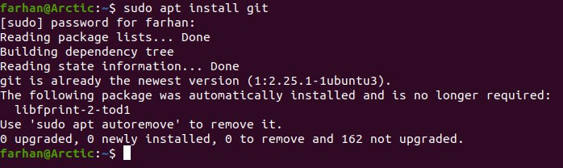

2. Dari hasil perintah berikut, disini saya sudah pernah menginstall git sebelumnya. Lalu untuk melihat versi yang digunakan ketikan perintah berikut.

# Konfigurasi Git

Ada 2 hal yang perlu dikonfigurasi yaitu username dan email. Konfig harus disesuaikan dengan nama serta email yang digunakan untuk mendaftar di GitHub. Untuk melihat konfigurasi yang sudah ada. Gunakan perintah berikut:

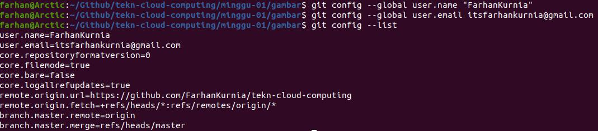

Langkah ini cukup dilakukan sekali saja, kecuali jika ingin melakukan perubahan nama dan email.

# Mengelola Repo Sendiri di Account Sendiri
## Membuat Repo

1. Buka web [Github] (https://github.com/). kemudian masuk ke akun untuk membuat repository baru.

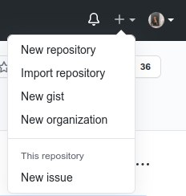

2.	Membuat repository baru dengan nama tekn-cloud-computing, jika sudah selesai klik create repository.

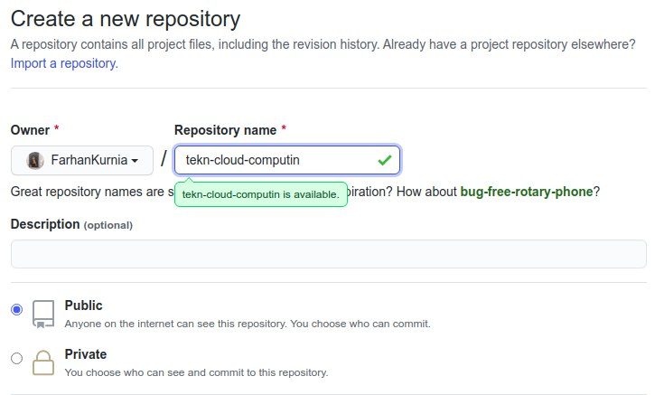

3.	Setelah selesai maka akan muncul repository seperti ini. Setelah langkah-langkah tersebut, repo akan dibuat dan bisa diakses menggunakan pola https://github.com/username/reponame.

## Clone repository

Proses clone adalah proses untuk menduplikasikan remote repo di GitHub ke komputer lokal. Untuk melakukan proses clone, gunakan perintah berikut:

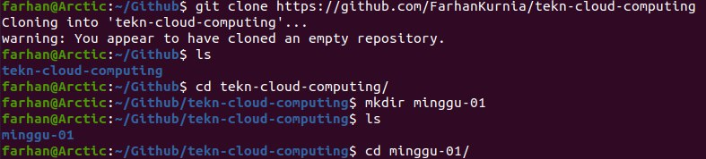

Setelah perintah ini, di direktori awesome-project akan disimpan isi repo yang sama dengan di GitHub. Perbedaannya, di komputer lokal terdapat direktori .git yang digunakan secara internal oleh Git.

# Mengelola Repo

### Mengubah Isi - Push Tanpa Branching dan Merging

Perubahan isi bisa terjadi karena satu atau kombinasi beberapa hal berikut:
1.	File dihapus
2.	File diedit
3.	Membuat file / direktori baru
4.	Menghapus direktori

Untuk kasus-kasus tersebut, lakukan perubahan di komputer lokal, setelah itu push ke repo.
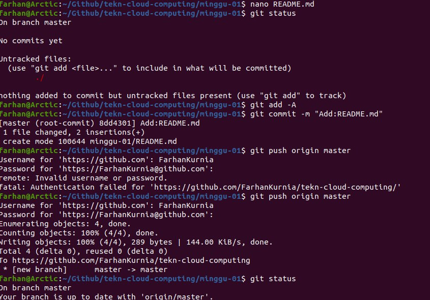

### Mengubah Isi dengan Branching and Merging

1.	Buat branch untuk menampung perubahan-perubahan
2.	Lakukan perubahan-perubahan
3.	Add dan commit perubahan-perubahan tersebut ke branch
4.	Kembali ke repo master
5.	Buat pull request di GitHub
6.	Merge pull request di GitHub
7.	Merge branch untuk menampung perubahan-perubahan tersebut ke master.
8.	Selesai.

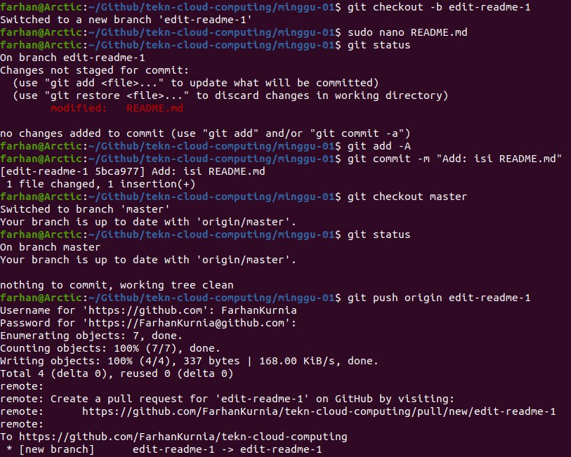

Membuat pull request agar bisa di-merge

Setelah itu, Confirm Merge, branch yang kita kirimkan tadi sudah dimasukkan ke branch master. Setelah itu, merge di komputer lokal:
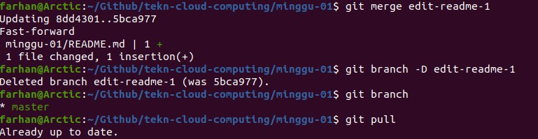

### Sinkronisasi

### Membatalkan Perubahan

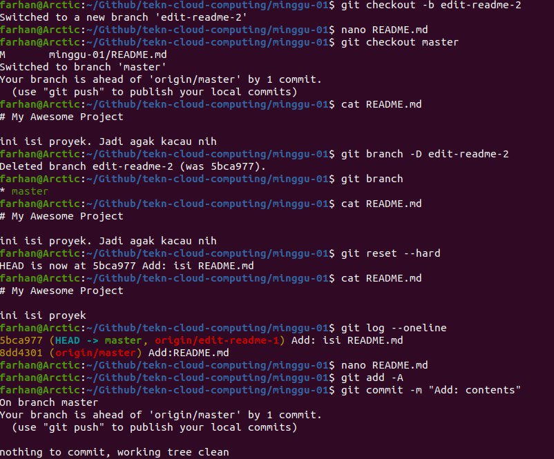
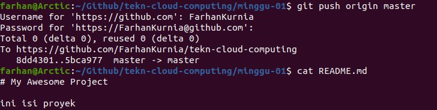

### Undo Commit Terakhir

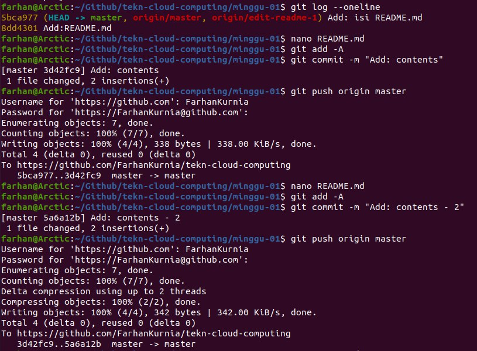

Contoh di atas adalah contoh untuk mengubah README.md dengan beberapa commit. Setelh itu, kita akan mengembalikan ke posisi terakhir sebelum commit terakhir.

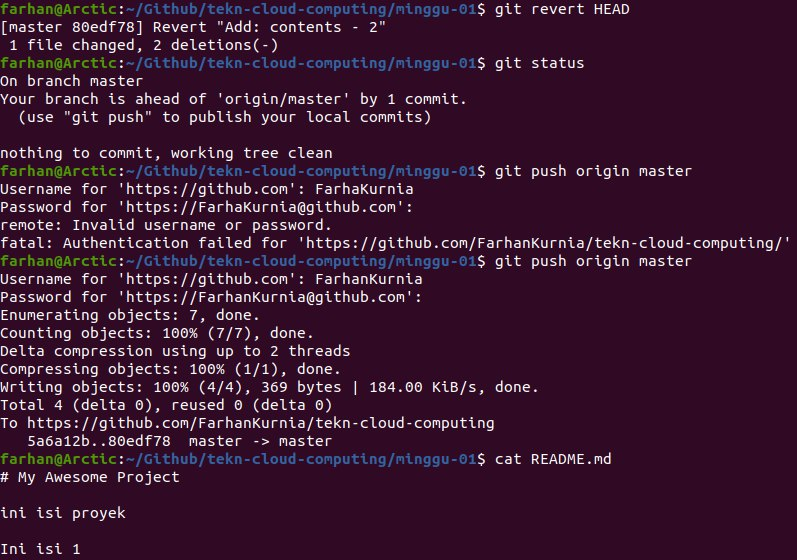

Jika commit sudah dilakukan, tetapi belum di-push ke repo GitHub (masih berada di lokal), cara membatalkannya:
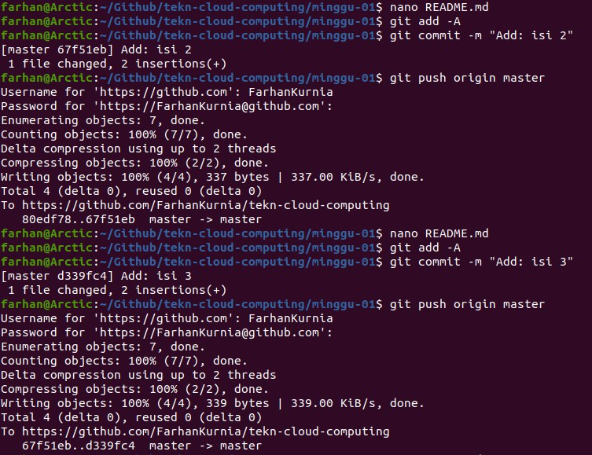
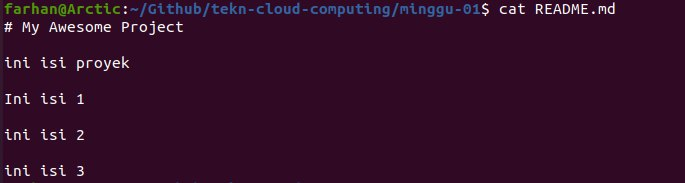

Untuk kembali ke perubahan pada saat yang sudah lama, yang perlu dilakukan adalah melakukan git revert <posisi> kemudian mengedit secara manual kemudian push ke repo.

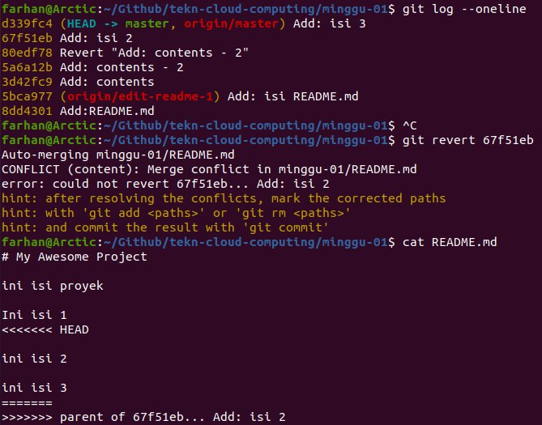

Edit file tersebut, setelah itu simpan.

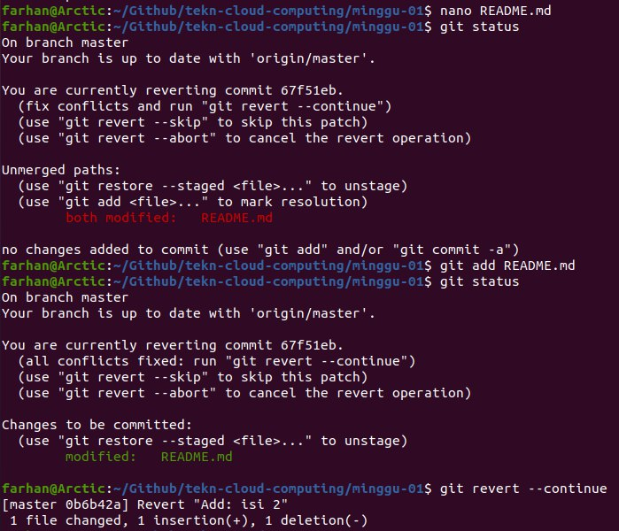

Setelah itu, lanjutkan proses revert. Saat git revert --continue isikan pesan revert.
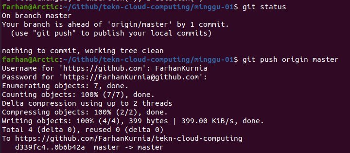