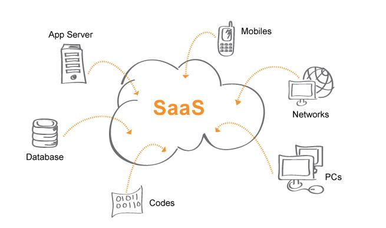

# Rangkuman Software as a Service
---
## Perbedaan antara IaaS, Saas dan Paas

**IaaS (Infrastructure as a Service)** 
IaaS adalah model *Cloud service* dimana sumber daya komputasinya disediakan secara virtual sehingga penggunanya memiliki kendali penuh terhadap infrastruktur yang digunakan, mulai dari server, jaringan, sistem operasi, storage dan ruang data center. Pengguna juga dapat membuat `"pusat data virtual"` di cloud dan memiliki akses ke seluruh data tanpa harus memiliki hardware tersendiri. 

Berikut adalah beberapa contoh SaaS: DigitalOcean, Amazon Web Services (AWS), Linode, Rackspace, Google Compute Engine (GCE), Microsoft Azure, Cisco Metapod.

**SaaS (Software as a Service)**
SaaS merupakan suatu lisensi perangkat lunak dan *delivery* model yang berbasis *cloud*, sehingga memungkinkan untuk tetap mengakses suatu software dimanapun dengan menggunakan device apapun melalui koneksi internet. Dalam SaaS, pengguna tidak perlu lagi melakukan install, update, atau menangani masalah pada software yang digunakan karena semua hal tersebut telah dikelola oleh vendor, pengguna hanya tinggal menggunakan service yang disediakan. 

Berikut adalah beberapa contoh SaaS: Google Apps, Salesforce, Hubspot, Zendesk, Slack, Ahrefs, Semrush, Majestic SEO, Drop Box, Mailchimp

**Platform as a Service (PaaS)**
PaaS adalah model *Cloud service* berupa framework yang digunakan oleh pengguna (developer) untuk membangun atau membuat perangkat lunak atau aplikasi. Sistem operasi, server dan segala kebutuhan yang diperlukan disediakan oleh vendor. Hal ini memungkinkan pengguna untuk lebih fokus pada pengembangan perangkat lunak.

Berikut adalah beberapa contoh PaaS: Google App Engine, Windows Azure, AWS Elastic Beanstalk

---
## SAAS (Software as a Service) Platform Architecture

Dengan model ini, satu versi aplikasi dengan satu konfigurasi dapat digunakan untuk semua pelanggan. Aplikasi diinstal pada beberapa mesin untuk mendukung skalabilitas (disebut penskalaan horizontal). 

Ada dua jenis utama SaaS:
**SaaS Vertical**
Perangkat lunak yang menjawab kebutuhan industri tertentu (misalnya, perangkat lunak untuk perawatan kesehatan, pertanian, real estat, industri keuangan)

**SaaS Horizontal**
Produk yang berfokus pada kategori perangkat lunak (pemasaran, penjualan, alat pengembang, SDM) tetapi bersifat agnostik industri.

Adapun manfaat SaaS, Pengguna dapat langsung menggunakan layanan tersebut tanpa harus membuat sendiri (in-house development). Pengguna layanan tidak perlu mengkhawatirkan tentang ketersediaan dan reliabilitas aplikasi, Karena hal tersebut sudah dijamin oleh penyedia layanan. Pengguna  layanan hanya perlu fokus pada data miliknya.

---
## Kelebihan dan Kelemahan SAAS (Software as a Service) Platform Architecture

Kelebihan:
- Sederhana
- Ekonomis
- Keamanan
- Kesesuaian

Kekurangan:
- Kurang dalam hal akses kontrol
- Ekosistem terbatas
- Performa
- Permasalahan data

---
## Cara membangun aplikasi SaaS berbasis cloud

1. Pilih bahasa pemograman yang tepat (Contoh: Python karena fleksibel dalam banyak kasus)

2. Database yang tepat (Database Document Oriented seperti Mongo DB)

3. Sistem antrian (Sebuah protokon komunikasi asinkron yang memungkinkan pengirim dan penerima berinteraksi disaat yang sama atau dikenal dengan MSMQ seperti RabbitMq)

Dengan Python, Mongo DB dan RabbitMQ sudah mencukupi dalam dasar pembangunan SaaS. Mungkin akan ada penambahan lain seperti kebutuhan software pemantauan dan analitik yang tepat.
---

### Referensi:
1. [What is the difference between IaaS, SaaS, and PaaS?](https://www.quora.com/What-is-the-difference-between-IaaS-SaaS-and-Paas)
2. [SaaS Platform Architecture.] (https://hackernoon.com/saas-software-as-a-service-platform-architecture-757a432270f5)
3. [SaaS (Software as a Service) Platform itecture.] (https://www.devteam.space/blog/saas-software-as-a-service-platform-architecture/)
4. [How to build a cloud-based SaaS Application] (https://usersnap.com/blog/cloud-based-saas-architecture-fundamentals/)
