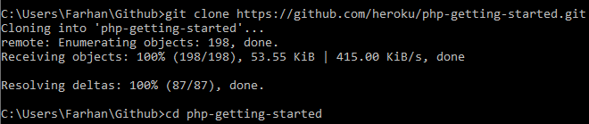
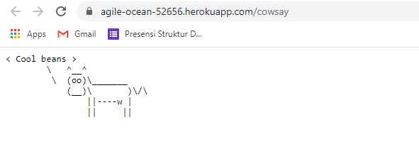

# Getting Started on Heroku with PHP
---
## Heroku dengan PHP

1.	Check kebutuhan
 
<div align="center"></div>

<div align="center"></div>

<div align="center"></div>
 
2.	Login Heroku 

<div align="center"></div>

3.	Mempersiapkan APP

<div align="center"></div>
 
4.	Deploy App

<div align="center"></div>

<div align="center"></div>
 
5.	Menjalankan aplikasi

<div align="center"></div>

<div align="center"></div>
 
6.	Melihat logs

<div align="center"></div>
 
 <div align="center"></div>

## Mendifine procfile

1.	Check berapa banyak dynos yang running

<div align="center"></div>

2.	Scaling aplikasi di Heroku 

<div align="center"></div>


## Declare dependensi dari suatu aplikasi

1.	Install dependensi

<div align="center"></div>


## Melakukan perubahan

1.	Menambahkan dependensi di composer

<div align="center"></div>
 
2.	Update composer

<div align="center"></div>

3.	Lakukan perubahan di file index.php

<div align="center"></div>
 
4.	Tambahkan perubahan ke git repository

<div align="center"></div> 

<div align="center"></div>
 
5.	Buka app di web yang sudah dilakukan perubahan: ```open cowsay```

<div align="center"></div>
 

## Penyediaan add-on

**NOTE : Untuk add-on diharuskan menggunakan account Heroku yang telah terverifikasi dengan credit card.**


## Memulai dengan tampilan shell
1.	Menjalankan di console, check environment

<div align="center"></div>

2.	Check file yang ada di dyno

<div align="center"></div>


## Define config vars
1.	Modifikasi file index.php

<div align="center"></div>
 
2.	Setting dan check config var di Heroku

<div align="center"></div>

<br>
<br>

***Sumber : [Getting Started on Heroku with PHP](https://devcenter.heroku.com/articles/getting-started-with-php?singlepage=true)***