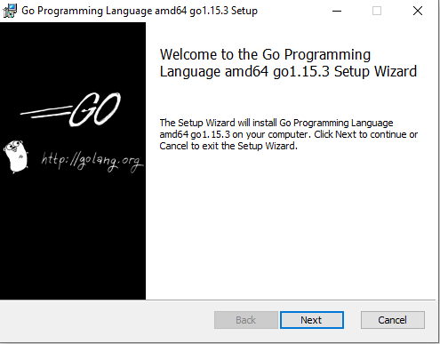
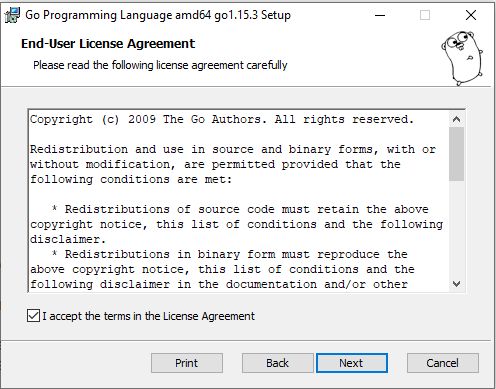
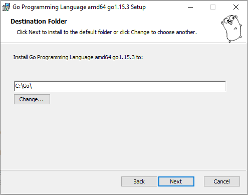
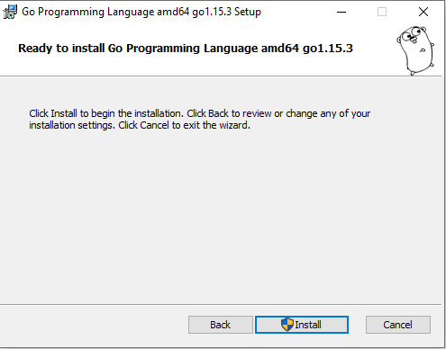
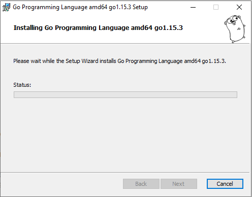
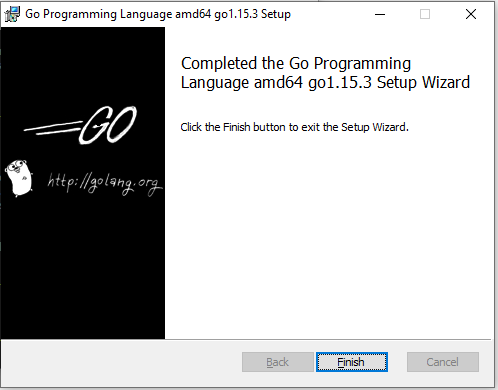
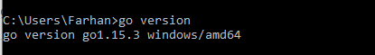

# Install Go, MySQL dan MongoDB

## Install Go 
1. Download GO Installer melalui (Golang)[https://golang.org/doc/install]

2. Install GO sesuai gambar dibawah, klik next untuk setiap stepnya. Tunggu hingga proses installasi selesai lalau klik finish.

3. Check versi Go

## Install MySQL
1. Download GO Installer melalui (MySQL)[https://dev.mysql.com/downloads/installer/]

2. Install MySQL sesuai gambar dibawah, klik next untuk setiap stepnya. Tunggu hingga proses installasi selesai lalau klik finish.

3. Check versi MySQL

## Install MongoDB
1. Download MongoDB Installer melalui (MongogDB)[https://www.mongodb.com/try/download/community?tck=docs_server]

2. Install MongoDB sesuai gambar dibawah, klik next untuk setiap stepnya. Tunggu hingga proses installasi selesai lalau klik finish.

3. Check versi MongoDB
