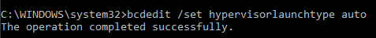

# Install Docker & Getting Started - Docker

## Install Docker
1. Docker dapat diinstall melalui [Docker](https://hub.docker.com/editions/community/docker-ce-desktop-windows/) 
2. Setelah download selesai install Docker sesuai gambar dibawah, klik next untuk setiap stepnya. Tunggu hingga proses installasi selesai lalau klik finish.

