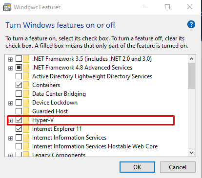

# Install Docker & Getting Started - Docker WIndows (Gagal Virtualization)

## Install Docker
1. Docker dapat diinstall melalui [Docker](https://hub.docker.com/editions/community/docker-ce-desktop-windows/) 
2. Setelah download selesai install Docker sesuai gambar dibawah, klik next untuk setiap stepnya. Tunggu hingga proses installasi selesai lalau klik finish.

3. Cek versi dari Docker yang sudah terinstall

## Getting Started with Docker on Windows

1. Disini saya mencoba menjalankan Docker namun muncul peringatan bahwa ada kendala di virtualization

2. Ketika saya cek untuk spesifikasi device posisi Virtualization dalam keadaan disable

 

3. Setelah itu saya mencari referensi di forum, pertama dapat dicek pada turn windows feature sudah terchecklist atau belum dan posisi sudah.

 

4. Setelah saya cek lagi Virtualization masih disable, lalu saya menjalankan script di power shell.

 

namun masih sama sehingga untuk praktikum saya ganti menggunakan [Ubuntu](latihanDockerUbuntu.md).
