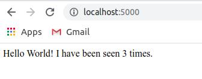
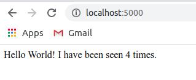
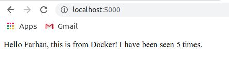

# Get started with Docker Compose

## Prerequisites
- Docker Engine
- Docker Compose

## Step 1: Setup
Membuat depedensi aplikasi
1.  Buat direktori project lalu masuk.
    ```bash
    farhan@Arctic:~$ mkdir composetest
    farhan@Arctic:~$ cd composetest/
    ```

2.  Buat file dengan nama app.py
    ```bash
    farhan@Arctic:~/composetest$ sudo nano app.py
    ```
    Lalu masukan script berikut.
    ```python
    import time

    import redis
    from flask import Flask

    app = Flask(__name__)
    cache = redis.Redis(host='redis', port=6379)

    def get_hit_count():
        retries = 5
        while True:
            try:
                return cache.incr('hits')
            except redis.exceptions.ConnectionError as exc:
                if retries == 0:
                    raise exc
                retries -= 1
                time.sleep(0.5)

    @app.route('/')
    def hello():
        count = get_hit_count()
        return 'Hello World! I have been seen {} times.\n'.format(count)
    ```

3. Buat file dengan nama requirements.txt
    ```bash
    farhan@Arctic:~/composetest$ nano requirements.txt
    ```

    Lalu masukan:
    ```
    flask
    redis
    ```

## Step 2: Membuat Dockerfile
1.  Buatlah file dengan nama Dockerfile
    ```bash
    farhan@Arctic:~/composetest$ nano Dockerfile
    ```

    Masukan:
    ```bash
    FROM python:3.7-alpine
    WORKDIR /code
    ENV FLASK_APP=app.py
    ENV FLASK_RUN_HOST=0.0.0.0
    RUN apk add --no-cache gcc musl-dev linux-headers
    COPY requirements.txt requirements.txt
    RUN pip install -r requirements.txt
    EXPOSE 5000
    COPY . .
    CMD ["flask", "run"]
    ```

## Step 3: Membuat layanan di dalam file compose
2.  Buatlah file dengan nama docker-compose.yml
    ```bash
    farhan@Arctic:~/composetest$ nano docker-compose.yml
    ```
    Lalu masukan:
    ```bash
    version: "3.8"
    services:
    web:
        build: .
        ports:
        - "5000:5000"
    redis:
        image: "redis:alpine"
    ```

    File Compose ini berisi layanan: Web dan Redis.


## Step 4: Membuat layanan di dalam file compose
1.  Dari direktori jalankan docker compose.
    ```bash
    farhan@Arctic:~/composetest$ docker-compose --version 
    docker-compose version 1.27.4, build 40524192
    farhan@Arctic:~/composetest$ docker-compose up
    Creating composetest_redis_1 ... done
    Creating composetest_web_1   ... done
    Attaching to composetest_redis_1, composetest_web_1
    redis_1  | 1:C 26 Nov 2020 11:12:10.190 # oO0OoO0OoO0Oo Redis is starting oO0OoO0OoO0Oo
    redis_1  | 1:C 26 Nov 2020 11:12:10.190 # Redis version=6.0.9, bits=64, commit=00000000, modified=0, pid=1, just started
    redis_1  | 1:C 26 Nov 2020 11:12:10.190 # Warning: no config file specified, using the default config. In order to specify a config file use redis-server /path/to/redis.conf
    redis_1  | 1:M 26 Nov 2020 11:12:10.201 * Running mode=standalone, port=6379.
    redis_1  | 1:M 26 Nov 2020 11:12:10.201 # Server initialized
    redis_1  | 1:M 26 Nov 2020 11:12:10.201 # WARNING overcommit_memory is set to 0! Background save may fail under low memory condition. To fix this issue add 'vm.overcommit_memory = 1' to /etc/sysctl.conf and then reboot or run the command 'sysctl vm.overcommit_memory=1' for this to take effect.
    redis_1  | 1:M 26 Nov 2020 11:12:10.202 * Ready to accept connections
    web_1    |  * Serving Flask app "app.py"
    web_1    |  * Environment: production
    web_1    |    WARNING: This is a development server. Do not use it in a production deployment.
    web_1    |    Use a production WSGI server instead.
    web_1    |  * Debug mode: off
    web_1    |  * Running on http://0.0.0.0:5000/ (Press CTRL+C to quit)
    web_1    | 172.18.0.1 - - [26/Nov/2020 11:13:09] "GET / HTTP/1.1" 200 -
    web_1    | 172.18.0.1 - - [26/Nov/2020 11:13:10] "GET /favicon.ico HTTP/1.1" 404 -
    web_1    | 172.18.0.1 - - [26/Nov/2020 11:13:16] "GET / HTTP/1.1" 200 -
    ```
2.  Buka Browser dan ketikkan localhost:5000.
    Akan muncul Hello World yaitu docker compose yang kita jalankan.
    <div align="center"></div>

3.  Ketik direfresh maka last seen akan bertambah.
    <div align="center"></div>

4.  Ketikkan docker mage ls pada terminal lain untuk melihat daftar image local.
    ```bash
    farhan@Arctic:~/Github/tekn-cloud-computing/minggu-08$ docker image ls
    REPOSITORY          TAG                 IMAGE ID            CREATED             SIZE
    composetest_web     latest              e98cbcc51b45        2 minutes ago       196MB
    python              3.7-alpine          f4bd0adb4b78        32 hours ago        41.7MB
    redis               alpine              c1949ec48c51        4 weeks ago         31.2MB
    ubuntu              latest              d70eaf7277ea        4 weeks ago         72.9MB
    hello-world         latest              bf756fb1ae65        10 months ago       13.3kB
    ```

## Step 5: Edit file compose untuk menambah bind mount
1.  Edit docker-compose.yml pada project dengan menambah bind mount untuk web service
    ```bash
    farhan@Arctic:~/composetest$ sudo nano docker-compose.yml 
    ```
    Ubah menjadi:
    ```bash
    version: "3.8"
    services:
    web:
        build: .
        ports:
        - "5000:5000"
        volumes:
        - .:/code
        environment:
        FLASK_ENV: development
    redis:
        image: "redis:alpine"
    ```

## Step 6: Jalankan compose
1.  Jalankan docker-compose up pada direktori project.
    ```bash
    farhan@Arctic:~/composetest$ docker-compose up
    Starting composetest_redis_1 ... done
    Recreating composetest_web_1 ... done
    Attaching to composetest_redis_1, composetest_web_1
    redis_1  | 1:C 26 Nov 2020 12:11:44.738 # oO0OoO0OoO0Oo Redis is starting oO0OoO0OoO0Oo
    redis_1  | 1:C 26 Nov 2020 12:11:44.738 # Redis version=6.0.9, bits=64, commit=00000000, modified=0, pid=1, just started
    redis_1  | 1:C 26 Nov 2020 12:11:44.738 # Warning: no config file specified, using the default config. In order to specify a config file use redis-server /path/to/redis.conf
    redis_1  | 1:M 26 Nov 2020 12:11:44.784 * Running mode=standalone, port=6379.
    redis_1  | 1:M 26 Nov 2020 12:11:44.785 # Server initialized
    redis_1  | 1:M 26 Nov 2020 12:11:44.785 # WARNING overcommit_memory is set to 0! Background save may fail under low memory condition. To fix this issue add 'vm.overcommit_memory = 1' to /etc/sysctl.conf and then reboot or run the command 'sysctl vm.overcommit_memory=1' for this to take effect.
    redis_1  | 1:M 26 Nov 2020 12:11:44.870 * Loading RDB produced by version 6.0.9
    redis_1  | 1:M 26 Nov 2020 12:11:44.870 * RDB age 272 seconds
    redis_1  | 1:M 26 Nov 2020 12:11:44.870 * RDB memory usage when created 0.79 Mb
    redis_1  | 1:M 26 Nov 2020 12:11:44.870 * DB loaded from disk: 0.048 seconds
    redis_1  | 1:M 26 Nov 2020 12:11:44.870 * Ready to accept connections
    web_1    |  * Serving Flask app "app.py" (lazy loading)
    web_1    |  * Environment: development
    web_1    |  * Debug mode: on
    web_1    |  * Running on http://0.0.0.0:5000/ (Press CTRL+C to quit)
    ```

## Step 7: Update aplikasi
1.  Hello world pada halaman dapat iubah melalui file app.py
    ```python
    return 'Hello Farhan, this is from Docker! I have been seen {} times.\n'.format(count)
    ```
    Lalu refresh kembali halaman di browser.
    <div align="center"></div>


## Step 8: Perintah lain
- ```docker-compose up -d``` : untuk menjalankan docker compose di belakang layar (detached).
- ```docker-compose ps`` : ntuk melihat service yang sedang berjalan.
- ```docker-compose stop``` : Untuk menghentikan service atau bisa dengan CTRL + C


