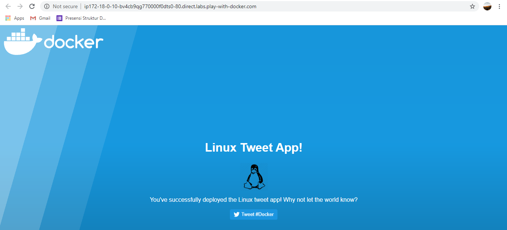
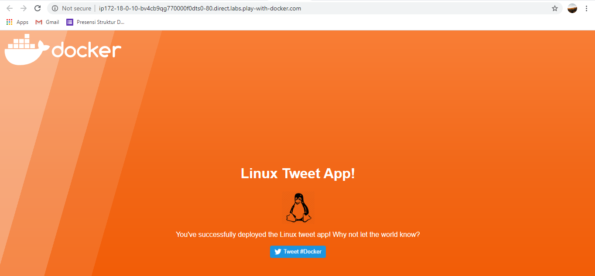
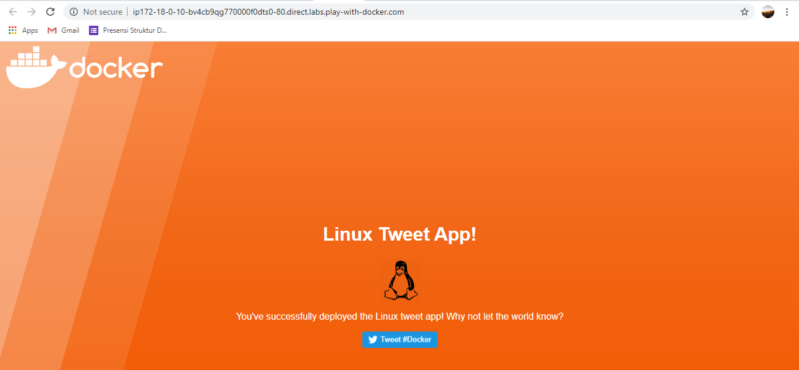

# Docker for Beginners - Linux

## Task 0: Prerequisites
Dalam lab ini kita membutuhkan:
- Cloning dari lab’s GitHub repo.
- DockerID.

### Clone the Lab’s GitHub Repo
Perintah berikut digunakan untuk clone lab's repo `linux_tweet_app`.
```bash
[node1] (local) root@192.168.0.8 ~
$     git clone https://github.com/dockersamples/linux_tweet_app
Cloning into 'linux_tweet_app'...
remote: Enumerating objects: 14, done.
remote: Total 14 (delta 0), reused 0 (delta 0), pack-reused 14
Receiving objects: 100% (14/14), 10.76 KiB | 10.76 MiB/s, done.
Resolving deltas: 100% (5/5), done.
```
Pastikan kita sudah memiliki Docker ID.

## Task 1: Run some simple Docker containers
Berikut adalah perbedaan penggunaan container:
1. Single task
2. Interactively
3. In the background

### Single Task Alpine Linux
Jalankan perintah berikut.
```bash
[node1] (local) root@192.168.0.8 ~
$  docker container run alpine hostname
Unable to find image 'alpine:latest' locally
latest: Pulling from library/alpine
188c0c94c7c5: Pull complete
Digest: sha256:c0e9560cda118f9ec63ddefb4a173a2b2a0347082d7dff7dc14272e7841a5b5a
Status: Downloaded newer image for alpine:latest
5dc906ab9714
```
Pada keluaran tersebut menunjukan image `alpine:latest` tidak dtemukan di lokal dan docker otomatis akan melakukan pull dari Docker Hub.
Lalu untuk melihat semua container dapat menggunakan:
```bash
[node1] (local) root@192.168.0.8 ~
$  docker container ls --all
CONTAINER ID        IMAGE               COMMAND             CREATED          STATUS                          PORTS               NAMES
5dc906ab9714        alpine              "hostname"          About a minute ago   Exited (0) About a minute ago                       reverent_wright
```

## Interactive Ubuntu Container
Jalankan Docker Container dan akses shell
```bash
[node1] (local) root@192.168.0.8 ~
$  docker container run --interactive --tty --rm ubuntu bash
Unable to find image 'ubuntu:latest' locally
latest: Pulling from library/ubuntu
da7391352a9b: Pull complete
14428a6d4bcd: Pull complete
2c2d948710f2: Pull complete
Digest: sha256:c95a8e48bf88e9849f3e0f723d9f49fa12c5a00cfc6e60d2bc99d87555295e4c
Status: Downloaded newer image for ubuntu:latest
root@1c0fb1f528ad:/# ls /
bin   dev  home  lib32  libx32  mnt  proc  run   srv  tmp  var
boot  etc  lib   lib64  media   opt  root  sbin  sys  usr
root@1c0fb1f528ad:/# ps aux
USER       PID %CPU %MEM    VSZ   RSS TTY      STAT START   TIME COMMAND
root         1  0.1  0.0   4108  3568 pts/0    Ss   11:04   0:00 bash
root         9  0.0  0.0   5896  2940 pts/0    R+   11:04   0:00 ps aux
root@1c0fb1f528ad:/# cat /etc/issue
Ubuntu 20.04.1 LTS \n \l

root@1c0fb1f528ad:/#  exit
exit
```
- ls = untuk melihat daftar directory pada container
- ps aux = untuk melihat proses yang berjalan
- cat /etc/issue = untuk melihat distro linux mana yang berjalan di container
- exit = untuk keluar dari shell

Pada virtual machine kita untuk melihat distro linuxnya sebagai berikut.
```bash
[node1] (local) root@192.168.0.8 ~
$  cat /etc/issue
Welcome to Alpine Linux 3.12
Kernel \r on an \m (\l)
```

## Background Running MySQL container
Jalankan container MySQL dengan perintah berikut.
```bash

[node1] (local) root@192.168.0.8 ~
$  docker container run \
>  --detach \
>  --name mydb \
>  -e MYSQL_ROOT_PASSWORD=my-secret-pw \
>  mysql:latest
Unable to find image 'mysql:latest' locally
latest: Pulling from library/mysql
852e50cd189d: Pull complete
29969ddb0ffb: Pull complete
a43f41a44c48: Pull complete
5cdd802543a3: Pull complete
b79b040de953: Pull complete
938c64119969: Pull complete
7689ec51a0d9: Pull complete
a880ba7c411f: Pull complete
984f656ec6ca: Pull complete
9f497bce458a: Pull complete
b9940f97694b: Pull complete
2f069358dc96: Pull complete
Digest: sha256:4bb2e81a40e9d0d59bd8e3dc2ba5e1f2197696f6de39a91e90798dd27299b093
Status: Downloaded newer image for mysql:latest
aeb6976755ddcef108f5ed78b0583973374fb4bbbd3614c2042548ad56276f8e
```
- --detach akan menjalankan container di background
- --name sebagai nama mydb
- -e akan digunakan untuk variabel environment untuk spesidikasi password root.

Karena image MySQL tidak tersedia di lokal, docker akan akan otomatis melakukan pull dari dari docker hub.

Selama prose MySQL running, Docker akan tetap menjalankan container di background.

Untuk melihat container yang berjalan gunakan perintah berikut.
```bash
[node1] (local) root@192.168.0.8 ~
$  docker container ls
CONTAINER ID        IMAGE               COMMAND                  CREATED             STATUS              PORTS                 NAMES
aeb6976755dd        mysql:latest        "docker-entrypoint.s…"   11 seconds ago      Up 10 seconds       3306/tcp, 33060/tcp   mydb
```

Untuk cek log dapat sebagai berikut.
```bash
onds ago      Up 10 seconds       3306/tcp, 33060/tcp   mydb
[node1] (local) root@192.168.0.8 ~
$  docker container logs mydb
2020-12-03 11:06:11+00:00 [Note] [Entrypoint]: Entrypoint script for MySQL Server 8.0.22-1debian10 started.
2020-12-03 11:06:12+00:00 [Note] [Entrypoint]: Switching to dedicated user 'mysql'
2020-12-03 11:06:12+00:00 [Note] [Entrypoint]: Entrypoint script for MySQL Server 8.0.22-1debian10 started.
2020-12-03 11:06:12+00:00 [Note] [Entrypoint]: Initializing database files
2020-12-03T11:06:12.138967Z 0 [System] [MY-013169] [Server] /usr/sbin/mysqld (mysqld 8.0.22) initializing of server in progress as process 44
2020-12-03T11:06:12.147163Z 1 [System] [MY-013576] [InnoDB] InnoDB initialization has started.
2020-12-03T11:06:12.850291Z 1 [System] [MY-013577] [InnoDB] InnoDB initialization has ended.
2020-12-03T11:06:14.320364Z 6 [Warning] [MY-010453] [Server] root@localhost is created with an empty password ! Please consider switching offthe --initialize-insecure option.
2020-12-03 11:06:17+00:00 [Note] [Entrypoint]: Database files initialized
2020-12-03 11:06:17+00:00 [Note] [Entrypoint]: Starting temporary server
2020-12-03T11:06:17.381990Z 0 [System] [MY-010116] [Server] /usr/sbin/mysqld (mysqld 8.0.22) starting as process 89
2020-12-03T11:06:17.416192Z 1 [System] [MY-013576] [InnoDB] InnoDB initialization has started.
2020-12-03T11:06:17.622402Z 1 [System] [MY-013577] [InnoDB] InnoDB initialization has ended.
2020-12-03T11:06:17.755027Z 0 [System] [MY-011323] [Server] X Plugin ready for connections. Socket: /var/run/mysqld/mysqlx.sock
2020-12-03T11:06:17.902944Z 0 [Warning] [MY-010068] [Server] CA certificate ca.pem is self signed.
2020-12-03T11:06:17.903894Z 0 [System] [MY-013602] [Server] Channel mysql_main configured to support TLS. Encrypted connections are now supported for this channel.
2020-12-03T11:06:17.906358Z 0 [Warning] [MY-011810] [Server] Insecure configuration for --pid-file: Location '/var/run/mysqld' in the path isaccessible to all OS users. Consider choosing a different directory.
2020-12-03T11:06:17.937404Z 0 [System] [MY-010931] [Server] /usr/sbin/mysqld: ready for connections. Version: '8.0.22'  socket: '/var/run/mysqld/mysqld.sock'  port: 0  MySQL Community Server - GPL.
2020-12-03 11:06:17+00:00 [Note] [Entrypoint]: Temporary server started.
Warning: Unable to load '/usr/share/zoneinfo/iso3166.tab' as time zone. Skipping it.
Warning: Unable to load '/usr/share/zoneinfo/leap-seconds.list' as time zone. Skipping it.
Warning: Unable to load '/usr/share/zoneinfo/zone.tab' as time zone. Skipping it.
Warning: Unable to load '/usr/share/zoneinfo/zone1970.tab' as time zone. Skipping it.

2020-12-03 11:06:21+00:00 [Note] [Entrypoint]: Stopping temporary server
2020-12-03T11:06:21.818345Z 10 [System] [MY-013172] [Server] Received SHUTDOWN from user root. Shutting down mysqld (Version: 8.0.22).
2020-12-03T11:06:23.432919Z 0 [System] [MY-010910] [Server] /usr/sbin/mysqld: Shutdown complete (mysqld 8.0.22)  MySQL Community Server - GPL.
2020-12-03 11:06:23+00:00 [Note] [Entrypoint]: Temporary server stopped

2020-12-03 11:06:23+00:00 [Note] [Entrypoint]: MySQL init process done. Ready for start up.

2020-12-03T11:06:24.173201Z 0 [System] [MY-010116] [Server] /usr/sbin/mysqld (mysqld 8.0.22) starting as process 1
2020-12-03T11:06:24.186286Z 1 [System] [MY-013576] [InnoDB] InnoDB initialization has started.
2020-12-03T11:06:24.424518Z 1 [System] [MY-013577] [InnoDB] InnoDB initialization has ended.
2020-12-03T11:06:24.564162Z 0 [System] [MY-011323] [Server] X Plugin ready for connections. Bind-address: '::' port: 33060, socket: /var/run/mysqld/mysqlx.sock
2020-12-03T11:06:24.704012Z 0 [Warning] [MY-010068] [Server] CA certificate ca.pem is self signed.
2020-12-03T11:06:24.704222Z 0 [System] [MY-013602] [Server] Channel mysql_main configured to support TLS. Encrypted connections are now supported for this channel.
2020-12-03T11:06:24.707698Z 0 [Warning] [MY-011810] [Server] Insecure configuration for --pid-file: Location '/var/run/mysqld' in the path isaccessible to all OS users. Consider choosing a different directory.
2020-12-03T11:06:24.744632Z 0 [System] [MY-010931] [Server] /usr/sbin/mysqld: ready for connections. Version: '8.0.22'  socket: '/var/run/mysqld/mysqld.sock'  port: 3306  MySQL Community Server - GPL.
```

Untuk melihat proses yang berjalan dalam container dengan perintah:
```bash
[node1] (local) root@192.168.0.8 ~
$    docker container top mydb
PID                 USER                TIME                COMMAND
1097                999                 0:01                mysqld
```
Kita dapat melihat MySQL daeomon (`mysqld`) sedang berjalan dalam container.

Lalu pada perintah berikut artinya mengizinkan kita untuk menjalankan perintah dalam sebuah container.
```bash
$  docker exec -it mydb \
>  mysql --user=root --password=$MYSQL_ROOT_PASSWORD --version
mysql: [Warning] Using a password on the command line interface can beinsecure.
mysql  Ver 8.0.22 for Linux on x86_64 (MySQL Community Server - GPL)
[node1] (local) root@192.168.0.8 ~
```

Atau kita dapat menggunakan perintah berikut untuk connect ke proses shell dalam sebuah container yang sedang berjalan.
 ```bash
 [node1] (local) root@192.168.0.8 ~
$  docker exec -it mydb sh
#  mysql --user=root --password=$MYSQL_ROOT_PASSWORD --version
mysql: [Warning] Using a password on the command line interface can beinsecure.
mysql  Ver 8.0.22 for Linux on x86_64 (MySQL Community Server - GPL)
#  exit
```


## Task 2: Package and run a custom app menggunakan Docker
Pada langkah ini kita akan belajar bagaimana untuk membungkus aplikasi sebagai images menggunakan dockerfile.

### Membuat website image
masuk ke direktory `linux_tweet_app`
```bash
[node1] (local) root@192.168.0.8 ~
$  cd ~/linux_tweet_app
```

Untuk melihat Dockerfle gunakan perintah berikut.
```bash
[node1] (local) root@192.168.0.8 ~/linux_tweet_app
$  cat Dockerfile
FROM nginx:latest

COPY index.html /usr/share/nginx/html
COPY linux.png /usr/share/nginx/html

EXPOSE 80 443

CMD ["nginx", "-g", "daemon off;"]
```

Lalu masukan perintah export docker dengan ID Docker yang dimiliki dengan perintah `export DOCKERID=<your docker id>`
```bash
[node1] (local) root@192.168.0.8 ~/linux_tweet_app
$ export DOCKERID=farhankurnia
```

echo nilai variable, pastikan menampilkan ID kalian.
```bash
[node1] (local) root@192.168.0.8 ~/linux_tweet_app
$  echo $DOCKERID
farhankurnia
```

Gunakan perintah berikut untuk membuat docker file baru.
```bash
[node1] (local) root@192.168.0.8 ~/linux_tweet_app
$  docker image build --tag $DOCKERID/linux_tweet_app:1.0 .
Sending build context to Docker daemon  92.16kB
Step 1/5 : FROM nginx:latest
latest: Pulling from library/nginx
852e50cd189d: Already exists
571d7e852307: Pull complete
addb10abd9cb: Pull complete
d20aa7ccdb77: Pull complete
8b03f1e11359: Pull complete
Digest: sha256:6b1daa9462046581ac15be20277a7c75476283f969cb3a61c8725ec38d3b01c3
Status: Downloaded newer image for nginx:latest
 ---> bc9a0695f571
Step 2/5 : COPY index.html /usr/share/nginx/html
 ---> a7c3c5195615
Step 3/5 : COPY linux.png /usr/share/nginx/html
 ---> 7012f8c02b96
Step 4/5 : EXPOSE 80 443
 ---> Running in 182e8214f24d
Removing intermediate container 182e8214f24d
 ---> 29fdbb550aca
Step 5/5 : CMD ["nginx", "-g", "daemon off;"]
 ---> Running in b8df48bcd091
Removing intermediate container b8df48bcd091
 ---> 8ef3fa939b98
Successfully built 8ef3fa939b98
Successfully tagged farhankurnia/linux_tweet_app:1.0
```

Gunakan perintah berikut untuk memulai container baru dari image yang telah dibuat.
```bash
Successfully tagged farhankurnia/linux_tweet_app:1.0
[node1] (local) root@192.168.0.8 ~/linux_tweet_app
$  docker container run \
>  --detach \
>  --publish 80:80 \
>  --name linux_tweet_app \
>  $DOCKERID/linux_tweet_app:1.0
431bf5ede18b9a251f16395c7b74dc37e4108567635611b298d26c80b3035f42
```

Lalu buka website
<div align="center"></div>

Sekali kita sudah mengakses website nya, matkan dan hapus.
```bash
[node1] (local) root@192.168.0.8 ~/linux_tweet_app
$  docker container rm --force linux_tweet_app
linux_tweet_app
```


## Task 3: Modifikasi website yang berjalan
### Mulai aplikasi web dengan bind mount
```bash
linux_tweet_app
[node1] (local) root@192.168.0.8 ~/linux_tweet_app
$  docker container run \
>  --detach \
>  --publish 80:80 \
>  --name linux_tweet_app \
>  --mount type=bind,source="$(pwd)",target=/usr/share/nginx/html \
>  $DOCKERID/linux_tweet_app:1.0
abb0b6346f79ac0b60183baf562752f7c61286e086b4b8da604c502ced786609
```
Setelah itu website akan berjalan.
<div align="center"></div>

### MOdifikasi website yang sedang berjalan
salin index.html ke dalam container
```bash
[node1] (local) root@192.168.0.8 ~/linux_tweet_app
$  cp index-new.html index.html
```
Lalu cek ke halaman website dan refesh, webite akan berubah.
<div align="center"></div>


### Update Image
buatlah image baru dengan tag 2.0
```bash
[node1] (local) root@192.168.0.8 ~/linux_tweet_app
$  docker image build --tag $DOCKERID/linux_tweet_app:2.0 .
Sending build context to Docker daemon  92.16kB
Step 1/5 : FROM nginx:latest
 ---> bc9a0695f571
Step 2/5 : COPY index.html /usr/share/nginx/html
 ---> 084ae1298379
Step 3/5 : COPY linux.png /usr/share/nginx/html
 ---> d6d7fe237421
Step 4/5 : EXPOSE 80 443
 ---> Running in 2721553faf6d
Removing intermediate container 2721553faf6d
 ---> b59c8ac98a32
Step 5/5 : CMD ["nginx", "-g", "daemon off;"]
 ---> Running in bf975f1d8515
Removing intermediate container bf975f1d8515
 ---> 27266bc5b0f3
Successfully built 27266bc5b0f3
Successfully tagged farhankurnia/linux_tweet_app:2.0
```

lalu cek images pada sistem
```bash
[node1] (local) root@192.168.0.8 ~/linux_tweet_app
$  docker image ls
REPOSITORY                     TAG                 IMAGE IDCREATED             SIZE
farhankurnia/linux_tweet_app   2.0                 27266bc5b0f345 seconds ago      133MB
farhankurnia/linux_tweet_app   1.0                 8ef3fa939b9812 minutes ago      133MB
ubuntu                         latest              f643c72bc2527 days ago          72.9MB
nginx                          latest              bc9a0695f5718 days ago          133MB
mysql                          latest              dd7265748b5d12 days ago         545MB
alpine                         latest              d6e46aa2470d6 weeks ago         5.57MB
```

### Test New Version
Jalankan container baru dari versi image yang baru
```bash
[node1] (local) root@192.168.0.8 ~/linux_tweet_app
$  docker container run \
>  --detach \
>  --publish 80:80 \
>  --name linux_tweet_app \
>  $DOCKERID/linux_tweet_app:2.0
220d067c9df00b8721a5b4cea0d488e5cf47f26c3cddc12496abdf8f5f3d13d7
```

cek versi terbaru dari website (warna orange)
<div align="center"></div>

Jalankan container yang lain
```bash
[node1] (local) root@192.168.0.8 ~/linux_tweet_app
$  docker container run \
>  --detach \
>  --publish 8080:80 \
>  --name old_linux_tweet_app \
>  $DOCKERID/linux_tweet_app:1.0
f8240d688062c82a4dc126f61154d9116fe8e835bfb989041e824313793818a1
```

cek versi web terlama
<div align="center"></div>

### Push images ke Docker Hub
list image kita pada docker hub
```bash
[node1] (local) root@192.168.0.8 ~/linux_tweet_app
$  docker image ls -f reference="$DOCKERID/*"
REPOSITORY                     TAG                 IMAGE IDCREATED             SIZE
farhankurnia/linux_tweet_app   2.0                 27266bc5b0f32 minutes ago       133MB
farhankurnia/linux_tweet_app   1.0                 8ef3fa939b9813 minutes ago      133MB
```

Sebelum nya kita harus login.
```bash
[node1] (local) root@192.168.0.8 ~/linux_tweet_app
$  docker login
Login with your Docker ID to push and pull images from Docker Hub. If you don't have a Docker ID, head over to https://hub.docker.com to create one.
Username: 
Password:
WARNING! Your password will be stored unencrypted in /root/.docker/config.json.
Configure a credential helper to remove this warning. See
https://docs.docker.com/engine/reference/commandline/login/#credentials-store

Login Succeeded
```

push versi 1.0 aplikasi web kita menggunakan docker image push
```bash
[node1] (local) root@192.168.0.8 ~/linux_tweet_app
$  docker image push $DOCKERID/linux_tweet_app:1.0
The push refers to repository [docker.io/farhankurnia/linux_tweet_app]
2f82c33a48c2: Pushed
db5f166bb63c: Pushed
7e914612e366: Mounted from library/nginx
f790aed835ee: Mounted from library/nginx
850c2400ea4d: Mounted from library/nginx
7ccabd267c9f: Mounted from library/nginx
f5600c6330da: Mounted from library/nginx
1.0: digest: sha256:10979dfe2a7cc10b010de545c6fbb2d8366a2d3585f802c000108e3821db8f7c size: 1777
```

sekarang push versi 2.0
```bash
[node1] (local) root@192.168.0.8 ~/linux_tweet_app
$  docker image push $DOCKERID/linux_tweet_app:2.0
The push refers to repository [docker.io/farhankurnia/linux_tweet_app]
518a13d64f16: Pushed
403964c8c874: Pushed
7e914612e366: Layer already exists
f790aed835ee: Layer already exists
850c2400ea4d: Layer already exists
7ccabd267c9f: Layer already exists
f5600c6330da: Layer already exists
2.0: digest: sha256:fbca2928e6831320b3072651d6afd0633fe56db5b48831cf9f0ba57142b349d3 size: 1777
```

kita dapat mencari docker image di https://hub.docker.com/r/`<your docker id>`/
